<div align="center">
<br/>
<br/>
  <h1 align="center">
    fly-next-platform
  </h1>
  <h4 align="center">
    开 箱 即 用 的 前 后 端 脚 手 架 框 架
  </h4>
</div>

<p align="center">
    <a href="#">
        
    </a>
    <a href="#">
        
    </a>
    <a href="#">
        
    </a>
    <a href="#">
        
    </a>
    <a href="#">
        
    </a>
</p>

<br>

### 🌈 介绍

* 基于 SpringBoot 实现的通用后台管理系统。 核心技术采用Spring、MyBatis、SpringSecurity，没有任何其它重度依赖，开箱即用。
* 核心模块包括：登录、用户管理、菜单管理、角色管理、数据字典、系统监控、操作日志、代码生成器 等功能。
* 代码量少、学习简单、功能强大、轻量级、易扩展，轻松开发从现在开始！

### ⛱️ 核心依赖

| 依赖          | 版本     |
|-------------|--------|
| Spring Boot | 3.0.6  |
| Mybatis     | 3.5.11 |
| pagehelper  | 5.3.2  |
| fastjson    | 2.0.21 |
| hutool      | 5.8.11 |

### ⚡ 内置功能
* 部门管理: 配置系统组织机构（公司、部门、小组）。
* 用户管理: 用户是系统操作者，该功能主要完成系统用户配置, 用户角色权限配置。
* 角色管理：角色菜单权限分配、设置角色范围权限划分。
* 菜单管理：配置系统菜单，操作权限，按钮权限标识等。
* 字典管理：对系统中经常使用的一些较为固定的数据进行维护。
* 应用管理: 多应用情况下，对多系统维护。
* 服务器监控: 监视当前系统CPU、内存、磁盘、堆栈等相关信息。
* 操作日志: 系统正常操作日志记录和查询。
* 代码生成器: 前后端代码的生成（java、html、xml、sql）支持CRUD下载。

### ⛱️ JQuery 版预览界面

| 界面                                | 界面                                |
|-----------------------------------|-----------------------------------|
| 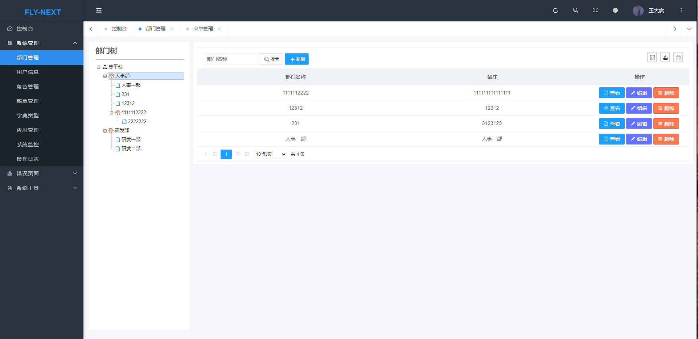 |  |
| 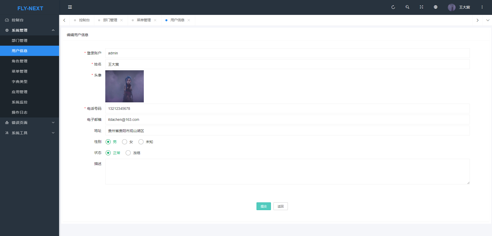 | 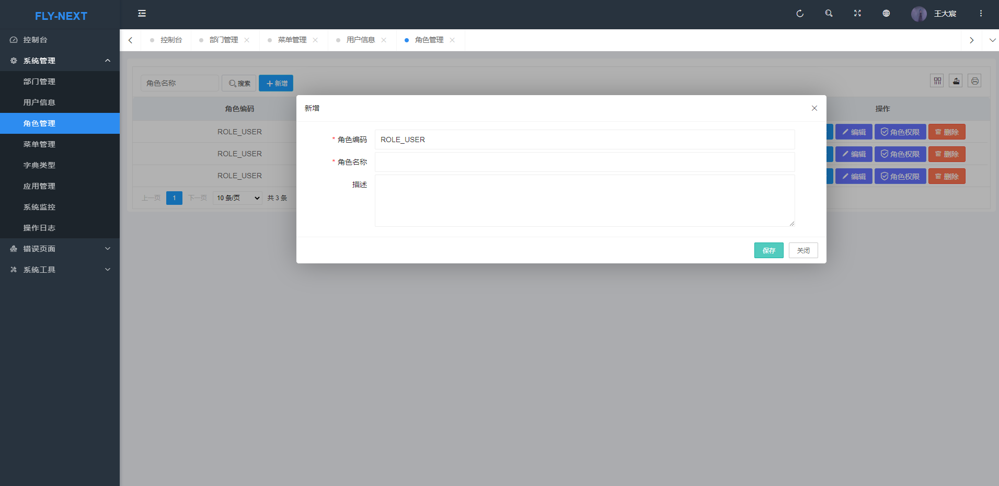 |
| 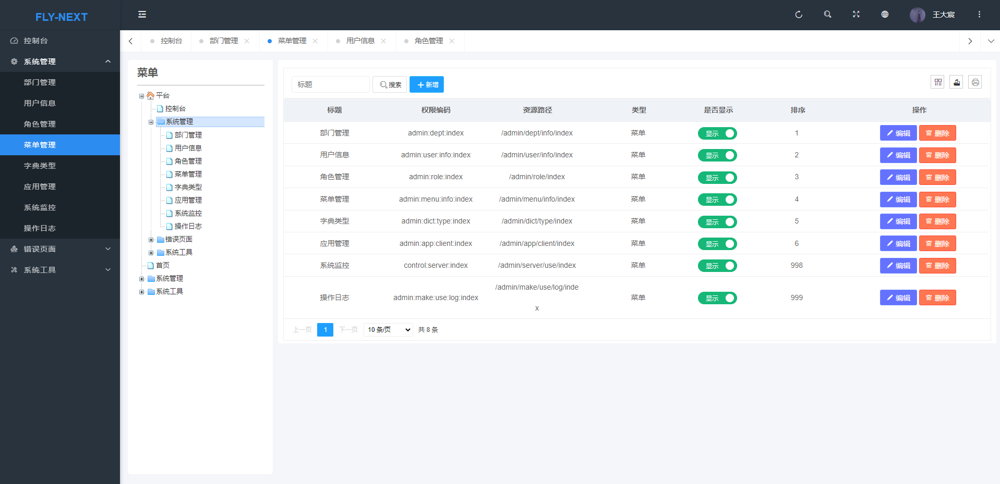 | 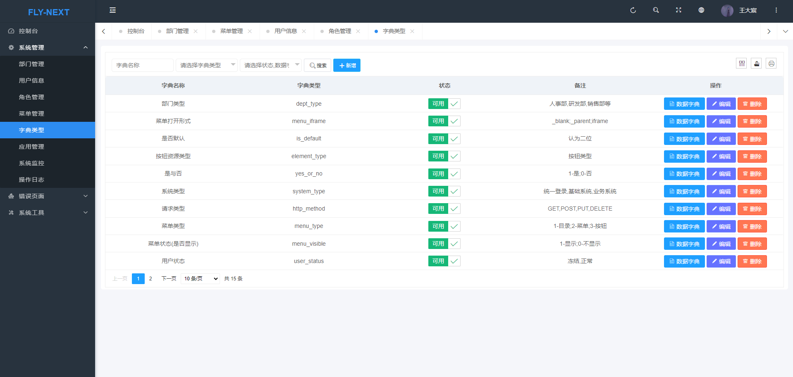 ||
| 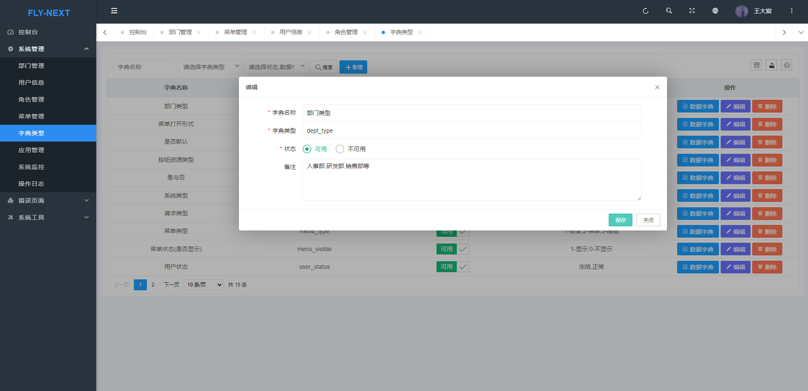 | 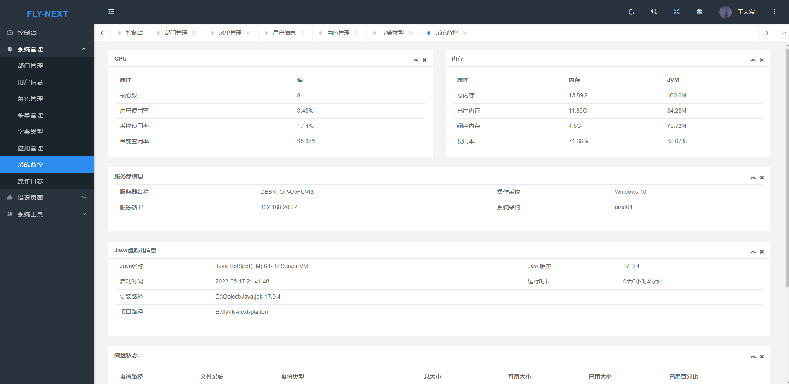 ||

### ⛱️ VUE 版预览界面(未完善)

| 界面                                | 界面                                |
|-----------------------------------|-----------------------------------|
| 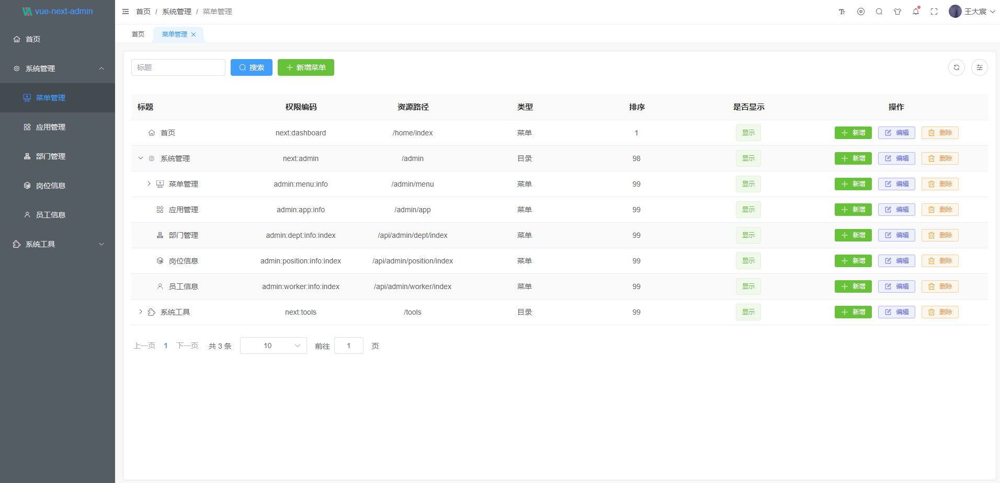   | 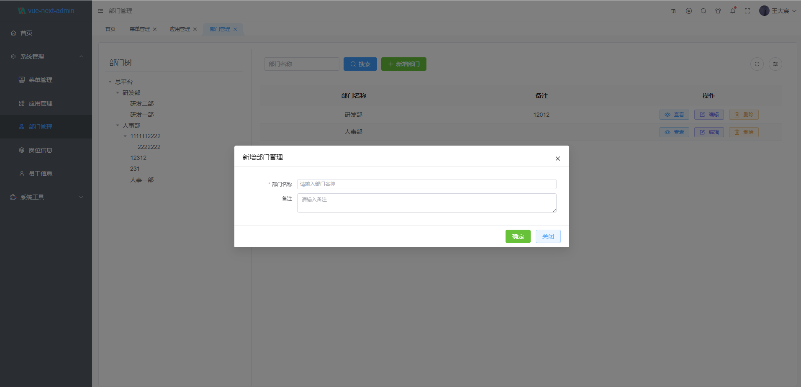 |
| 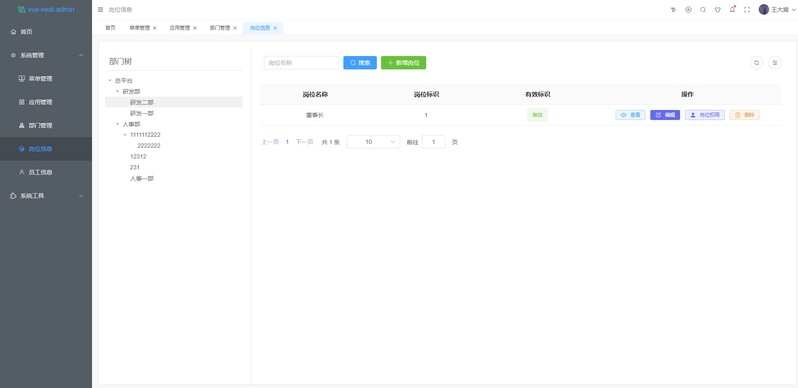 | 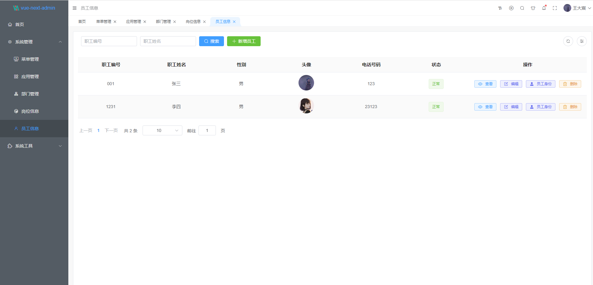 |
| 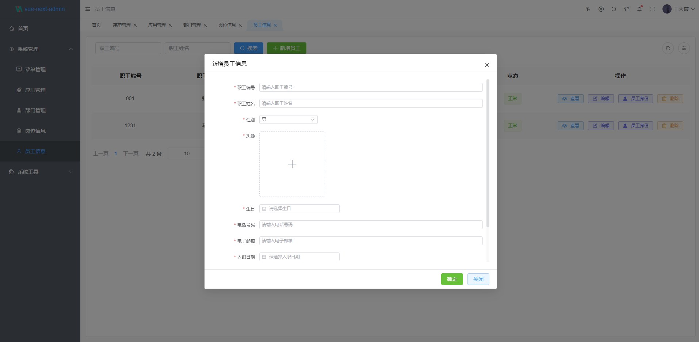 | 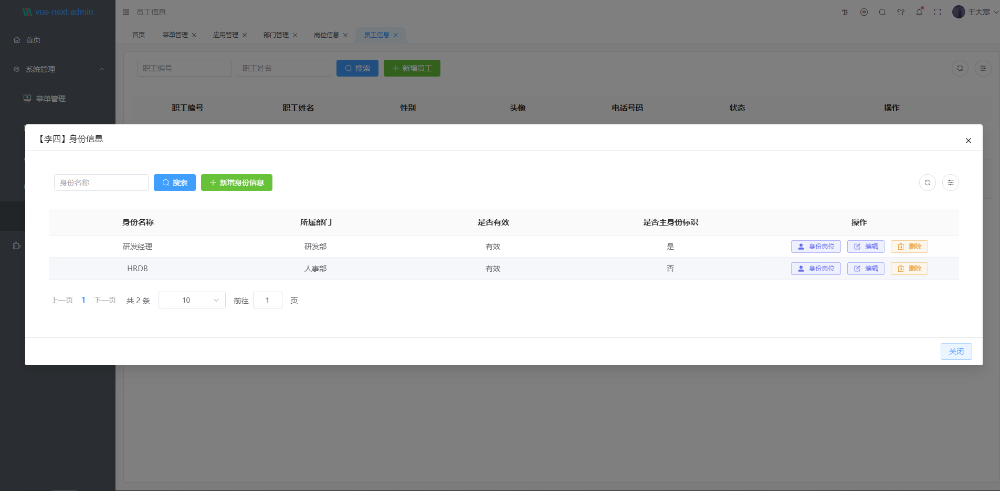 ||

### 📚 前端UI
* JQ版本 [Pear Admin Layui](https://gitee.com/pear-admin/Pear-Admin-Layui)
* vue版本 [vue-next-admin](https://gitee.com/lyt-top/vue-next-admin)

### 💒 代码依赖仓库

[码云](https://gitee.com/itdachen/fly-framework) | [Github](https://github.com/itdachen/fly-framework)

### 🚧 安装方式

* 基础依赖项目:

```lua 
git clone https://gitee.com/itdachen/fly-framework.git
```

*  打开 fly-framework

```lua 
cd /fly-dependencies
mvn clean 
mvn install
```

* 返回根目录安装基础依赖(fly-framework)

```lua 
cd ..
mvn clean 
mvn install
```

### 🏭 模块说明

```lua
fly-next-platform
├── fly-app -- 微信小程序
├── fly-next-admin -- 后台管理系统
├── fly-next-api -- 前后端分离接口模块
├── fly-next-server -- 项目开发模块
├── fly-next-ui -- 前后端分离VUE前端
└── end
```